# 🧩 SKELETON TEMPLATES & CHECKLISTS

## 📋 MỤC LỤC

- [Sơ đồ Mermaid Flowchart](#sơ-đồ-mermaid-flowchart)
- [Cấu trúc JSON mẫu của logs](#cấu-trúc-json-mẫu-của-logs)
- [Template skill file .md chuẩn](#template-skill-file-md-chuẩn)
- [System prompt cho Agent có Knowledge Injection](#system-prompt-cho-agent-có-knowledge-injection)
- [System prompt cho Distillation LLM](#system-prompt-cho-distillation-llm)
- [Checklist 60 điều kiện để pipeline chạy an toàn](#checklist-60-điều-kiện-để-pipeline-chạy-an-toàn)

---

## 📊 Sơ đồ Mermaid Flowchart

```mermaid
graph TB
    Start([Start]) --> Training[Training Phase]
    
    Training --> LoadRaw[Load Raw Data]
    LoadRaw --> Preprocess[Preprocess]
    Preprocess --> Tokenize[Tokenize]
    Tokenize --> Split[Create Splits]
    Split --> Train[Train Model]
    Train --> SaveModel[Save Model]
    SaveModel --> AgentPhase[Agent Phase]
    
    AgentPhase --> LoadModel[Load Model]
    LoadModel --> LoadSkills[Load Skills]
    LoadSkills --> LoadPrompts[Load Prompts]
    LoadPrompts --> UserRequest[User Request]
    
    UserRequest --> Reasoner[Reasoner]
    Reasoner --> ActionScheduler[Action Scheduler]
    ActionScheduler --> ToolCall[Tool Call]
    ToolCall --> Execute[Execute]
    Execute --> Log[Log Step]
    
    Log --> Success{Success?}
    Success -->|Yes| Response[Response]
    Success -->|No| ErrorHandler[Error Handler]
    ErrorHandler --> Retry{Retry?}
    Retry -->|Yes| ToolCall
    Retry -->|No| Fallback[Fallback]
    Fallback --> Response
    
    Response --> SaveLogs[Save Logs]
    SaveLogs --> DistillationPhase[Distillation Phase]
    
    DistillationPhase --> ReadLogs[Read Logs]
    ReadLogs --> Analyze[Analyze Patterns]
    Analyze --> ExtractSkills[Extract Skills]
    ExtractSkills --> GenerateSkills[Generate Skill Files]
    GenerateSkills --> UpdateGraph[Update Knowledge Graph]
    UpdateGraph --> UpdateSkills[Update Skills Folder]
    
    UpdateSkills --> NextRun[Next Run]
    NextRun --> LoadModel
    
    Response --> End([End])
```



---

## 📄 Cấu trúc JSON mẫu của logs

### Log Entry Structure

```json
{
  "session_id": "session_20240101_123456",
  "timestamp": "2024-01-01T12:34:56Z",
  "user_query": "Crawl truyện X từ trang Y",
  "agent_version": "v1.0.0",
  "model_version": "base_model_v1",
  "skills_loaded": [
    "skills/core/reasoning_basics.md",
    "skills/emergent/skill_retry429.md"
  ],
  "steps": [
    {
      "step_id": 1,
      "timestamp": "2024-01-01T12:34:57Z",
      "type": "reasoning",
      "content": "User wants to crawl novel X. I need to: 1) Find the novel page, 2) Discover pagination, 3) Extract chapters",
      "confidence": 0.9
    },
    {
      "step_id": 2,
      "timestamp": "2024-01-01T12:34:58Z",
      "type": "tool_call",
      "tool": "crawler",
      "action": "get_page",
      "parameters": {
        "url": "https://example.com/novel-x"
      },
      "result": {
        "status": "success",
        "content_length": 50000,
        "status_code": 200
      },
      "duration_ms": 1200
    },
    {
      "step_id": 3,
      "timestamp": "2024-01-01T12:35:00Z",
      "type": "tool_call",
      "tool": "pagination_discoverer",
      "action": "find_pages",
      "parameters": {
        "base_url": "https://example.com/novel-x",
        "html": "..."
      },
      "result": {
        "status": "success",
        "pages_found": 10,
        "pages": ["/page/1", "/page/2", ...]
      },
      "duration_ms": 500
    },
    {
      "step_id": 4,
      "timestamp": "2024-01-01T12:35:01Z",
      "type": "error",
      "error_type": "HTTP_429",
      "message": "Rate limit exceeded",
      "tool": "crawler",
      "action": "get_page",
      "handled_by": "skills/emergent/skill_retry429.md",
      "retry_count": 1,
      "resolution": "Applied exponential backoff, retrying after 5s"
    },
    {
      "step_id": 5,
      "timestamp": "2024-01-01T12:35:06Z",
      "type": "tool_call",
      "tool": "crawler",
      "action": "get_page",
      "parameters": {
        "url": "https://example.com/novel-x/page/1"
      },
      "result": {
        "status": "success",
        "status_code": 200
      },
      "duration_ms": 1100
    }
  ],
  "final_result": {
    "status": "success",
    "chapters_crawled": 100,
    "total_duration_seconds": 300,
    "output_path": "training/dataset/raw/novel-x/"
  },
  "evaluation": {
    "success": true,
    "steps_count": 50,
    "errors_count": 2,
    "retries_count": 3,
    "reasoning_quality": 0.85,
    "hallucination_detected": false,
    "repetition_detected": false
  },
  "metadata": {
    "skills_used": [
      "reasoning_basics",
      "retry429",
      "pagination_recognizer"
    ],
    "tools_used": [
      "crawler",
      "pagination_discoverer",
      "chapter_extractor"
    ],
    "memory_retrieved": 3,
    "fallbacks_triggered": 1
  }
}
```

---

## 📝 Template skill file .md chuẩn

### Format chuẩn (theo Anthropic style)

```markdown
# Skill: [Skill Name]

## Metadata
- **ID**: `skill_xxx`
- **Version**: `v1.0.0`
- **Created**: `2024-01-01`
- **Last Updated**: `2024-01-01`
- **Category**: `core` | `emergent` | `meta`
- **Dependencies**: `[skill_id_1, skill_id_2]`

## Description
[Brief description of what this skill does]

## When to Use
- Situation 1: [When this skill should be applied]
- Situation 2: [Another scenario]
- Trigger conditions: [Specific conditions that activate this skill]

## How to Apply

### Step 1: [Action]
[Description of what to do]

### Step 2: [Action]
[Description of what to do]

### Step 3: [Action]
[Description of what to do]

## Examples

### Example 1: [Scenario]
**Input:**
```
[Example input or situation]
```

**Application:**
```
[How the skill is applied]
```

**Output:**
```
[Expected output]
```

### Example 2: [Scenario]
[Similar structure]

## Edge Cases

### Case 1: [Edge case]
[How to handle]

### Case 2: [Edge case]
[How to handle]

## Error Handling
- **Error Type 1**: [How to handle]
- **Error Type 2**: [How to handle]

## Performance Notes
- Expected duration: [time]
- Resource usage: [CPU/Memory]
- Success rate: [percentage]

## Related Skills
- `skill_xxx_related_1`: [Relationship]
- `skill_xxx_related_2`: [Relationship]

## Changelog
- `v1.0.0` (2024-01-01): Initial version
```

### Ví dụ cụ thể: `skill_retry429.md`

```markdown
# Skill: Retry on HTTP 429

## Metadata
- **ID**: `skill_retry429`
- **Version**: `v1.0.0`
- **Created**: `2024-01-01`
- **Category**: `emergent`
- **Dependencies**: `[]`

## Description
Automatically retry HTTP requests when encountering 429 (Too Many Requests) status code with exponential backoff strategy.

## When to Use
- HTTP request returns status code 429
- Rate limit error message detected
- API returns "rate limit exceeded"

## How to Apply

### Step 1: Detect 429 Error
Check if response status code is 429 or error message contains rate limit keywords.

### Step 2: Calculate Backoff Delay
Use exponential backoff: `delay = base_delay * (2 ^ retry_count)`
- Base delay: 1 second
- Max delay: 60 seconds
- Max retries: 5

### Step 3: Wait and Retry
Wait for calculated delay, then retry the request.

### Step 4: Log Retry
Log the retry attempt with delay duration and retry count.

## Examples

### Example 1: Simple Retry
**Input:**
```
HTTP 429 response from crawler.get_page(url)
```

**Application:**
```
1. Detect 429
2. Calculate delay: 1s (retry 1), 2s (retry 2), 4s (retry 3)
3. Wait and retry
4. Success on retry 2
```

**Output:**
```
Request successful after 2 retries, total delay 3s
```

## Edge Cases

### Case 1: Max Retries Exceeded
If max retries reached, fallback to alternative strategy (e.g., use different endpoint, reduce request rate).

### Case 2: Different Rate Limit Windows
Some APIs have different rate limit windows. Check `Retry-After` header if available.

## Error Handling
- **Max retries exceeded**: Trigger fallback strategy
- **Network error during retry**: Treat as new error, restart retry counter
- **429 persists after all retries**: Report failure, suggest manual intervention

## Performance Notes
- Expected duration: 1-60 seconds (depending on retry count)
- Resource usage: Low (just waiting)
- Success rate: ~90% (most rate limits are temporary)

## Related Skills
- `skill_fallback_chain`: Used when max retries exceeded
- `skill_rate_limit_prevention`: Prevent 429 before it happens

## Changelog
- `v1.0.0` (2024-01-01): Initial version, extracted from logs
```

---

## 💬 System prompt cho Agent có Knowledge Injection

```markdown
# System Prompt: AI Agent with Knowledge Injection

You are an advanced AI agent capable of performing complex tasks through reasoning, tool usage, and learned skills.

## Your Capabilities

1. **Reasoning**: You can break down complex tasks into steps and reason through solutions.
2. **Tool Usage**: You have access to various tools (crawler, file ops, search, etc.).
3. **Skill Application**: You can apply learned skills from your knowledge base.
4. **Error Handling**: You can detect errors and apply appropriate recovery strategies.
5. **Memory**: You can remember past interactions and retrieve relevant information.

## Knowledge Base

You have access to a knowledge base of skills located in `skills/`:

### Core Skills (`skills/core/`)
- Basic reasoning patterns
- Consistency checking
- Anti-repetition mechanisms
- Common problem-solving patterns

### Emergent Skills (`skills/emergent/`)
- Skills learned from past experiences
- Specific solutions to recurring problems
- Optimized strategies for common tasks

### Meta Skills (`skills/meta/`)
- Self-reflection and improvement
- Error repair strategies
- Fallback chains

**When facing a problem:**
1. First, check if you have a relevant skill in your knowledge base
2. If found, apply the skill according to its instructions
3. If not found, reason through the problem step by step
4. After solving, consider if this could become a new skill

## Tool Usage Guidelines

- Always validate tool parameters before calling
- Handle errors gracefully with retries and fallbacks
- Log all tool calls for later analysis
- Respect rate limits and use appropriate delays

## Error Handling

When encountering errors:
1. Identify the error type
2. Check if a skill exists for this error type
3. Apply the skill if available
4. If no skill exists, use general error handling
5. Log the error and resolution for future learning

## Output Format

Always structure your responses clearly:
- State your reasoning process
- List the steps you're taking
- Show tool calls and results
- Provide final answer or status

## Constraints

- Never make up information
- Always verify results when possible
- Respect rate limits and API constraints
- Log all actions for analysis
- Apply skills when appropriate

## Current Context

[This section will be dynamically injected with:]
- Relevant skills for current task
- Recent memory/context
- Current session information
```

---

## 🔬 System prompt cho Distillation LLM

```markdown
# System Prompt: Knowledge Distillation LLM

You are a specialized LLM responsible for analyzing agent execution logs and extracting reusable knowledge in the form of skills.

## Your Task

Analyze agent logs and:
1. Identify successful patterns and strategies
2. Detect common mistakes and failure modes
3. Extract reusable skills from behavior
4. Generate skill files in markdown format
5. Update knowledge graph with skill relationships

## Input Format

You will receive:
- Agent execution logs (JSON format)
- Session metadata
- Success/failure indicators
- Evaluation scores

## Analysis Process

### Step 1: Pattern Detection
- Identify recurring action sequences
- Find successful strategies
- Detect common error patterns
- Note effective error handling

### Step 2: Skill Extraction
For each identified pattern:
- Determine if it's generalizable
- Extract the core logic
- Identify when to apply
- Document how to apply

### Step 3: Skill Generation
Create skill file with:
- Clear description
- When to use
- How to apply (step-by-step)
- Examples
- Edge cases
- Error handling

### Step 4: Knowledge Graph Update
- Map skill dependencies
- Identify related skills
- Update version information

## Output Format

### Skill File (Markdown)
Follow the template in `SKELETON_TEMPLATES.md`

### Knowledge Graph Update
```json
{
  "skill_id": "skill_xxx",
  "version": "v1.0.0",
  "dependencies": ["skill_a", "skill_b"],
  "related_skills": ["skill_c"],
  "category": "emergent"
}
```

## Quality Criteria

A good skill should:
- Be generalizable (not too specific)
- Have clear application conditions
- Include examples
- Handle edge cases
- Be testable

## Avoid

- Overly specific skills (tied to one exact scenario)
- Skills that duplicate existing ones
- Skills without clear application conditions
- Skills that are too complex (should be broken down)

## Focus Areas

1. **Error Handling**: Skills for common errors
2. **Optimization**: Skills that improve efficiency
3. **Pattern Recognition**: Skills for identifying patterns
4. **Recovery**: Skills for recovering from failures
5. **Prevention**: Skills for avoiding common mistakes
```

---

## ✅ Checklist 60 điều kiện để pipeline chạy an toàn

### Training Phase (15 điều kiện)

#### Data Preparation
- [ ] 1. Raw data tồn tại và có thể đọc được
- [ ] 2. Ít nhất 10,000 samples để training
- [ ] 3. Data đã được validate (không có file corrupt)
- [ ] 4. Encoding là UTF-8 và consistent
- [ ] 5. Không có file trống hoặc quá ngắn (< 100 bytes)

#### Preprocessing
- [ ] 6. Preprocessing script chạy thành công
- [ ] 7. Output preprocessed data có format đúng
- [ ] 8. Không mất dữ liệu trong quá trình preprocessing
- [ ] 9. Text đã được normalize (whitespace, encoding)
- [ ] 10. Filter đã loại bỏ chapter quá ngắn

#### Tokenization
- [ ] 11. Tokenizer được train hoặc load thành công
- [ ] 12. Vocabulary size hợp lý (không quá lớn/nhỏ)
- [ ] 13. Special tokens được định nghĩa đúng
- [ ] 14. Tokenized data có thể decode lại được
- [ ] 15. Max sequence length được set đúng

### Agent Phase (20 điều kiện)

#### Model Loading
- [ ] 16. Model file tồn tại và có thể load
- [ ] 17. Model architecture match với checkpoint
- [ ] 18. Tokenizer match với model
- [ ] 19. Model có thể inference được
- [ ] 20. GPU/Memory đủ để load model

#### Skills Loading
- [ ] 21. Skills folder tồn tại
- [ ] 22. Core skills được load thành công
- [ ] 23. Emergent skills được load thành công
- [ ] 24. Skills có format đúng (markdown)
- [ ] 25. Skills dependencies được resolve

#### Prompts
- [ ] 26. System prompts tồn tại
- [ ] 27. Prompts có thể inject skills
- [ ] 28. Prompt length không vượt quá limit
- [ ] 29. Prompts được format đúng

#### Tools
- [ ] 30. Tool registry được khởi tạo
- [ ] 31. Tất cả tools có thể import được
- [ ] 32. Tool permissions được set đúng
- [ ] 33. Tools có error handling
- [ ] 34. Tools có logging

#### Runtime
- [ ] 35. Memory system hoạt động
- [ ] 36. Logging system hoạt động
- [ ] 37. Error handler được khởi tạo
- [ ] 38. Action scheduler hoạt động
- [ ] 39. Execution engine hoạt động

#### Safety
- [ ] 40. Rate limiting được implement
- [ ] 41. Timeout được set cho mọi operation
- [ ] 42. Max retries được limit
- [ ] 43. Resource usage được monitor
- [ ] 44. Error không crash toàn bộ system

### Distillation Phase (15 điều kiện)

#### Log Analysis
- [ ] 45. Logs tồn tại và có thể đọc được
- [ ] 46. Log format đúng (JSON)
- [ ] 47. Logs có đủ thông tin để phân tích
- [ ] 48. Logs không bị corrupt

#### Pattern Detection
- [ ] 49. Pattern detector hoạt động
- [ ] 50. Có thể identify successful patterns
- [ ] 51. Có thể identify failure patterns
- [ ] 52. Pattern extraction không tạo duplicate

#### Skill Generation
- [ ] 53. Skill generator hoạt động
- [ ] 54. Skills được generate đúng format
- [ ] 55. Skills không duplicate existing ones
- [ ] 56. Skills có đủ thông tin (description, examples)

#### Knowledge Graph
- [ ] 57. Knowledge graph được update
- [ ] 58. Dependencies được map đúng
- [ ] 59. Versioning hoạt động
- [ ] 60. Graph không có cycles trong dependencies

### System Level (10 điều kiện)

#### Configuration
- [ ] 61. Config files tồn tại và valid
- [ ] 62. API keys được set (nếu cần)
- [ ] 63. Paths được config đúng
- [ ] 64. Environment variables được set

#### Persistence
- [ ] 65. Database/file storage hoạt động
- [ ] 66. Có thể save và load data
- [ ] 67. Versioning system hoạt động

#### CLI
- [ ] 68. CLI commands hoạt động
- [ ] 69. Help messages đầy đủ
- [ ] 70. Error messages rõ ràng

---

## 🎯 Quick Reference

### Khi bắt đầu code, check:

1. **Training**: Items 1-15
2. **Agent**: Items 16-44
3. **Distillation**: Items 45-60
4. **System**: Items 61-70

### Priority Order:

1. **Critical** (phải có để chạy):
   - Data exists (1)
   - Model loads (16-19)
   - Tools work (30-34)
   - Logging works (36)

2. **Important** (cần để hoạt động tốt):
   - Skills load (21-25)
   - Error handling (37, 40-44)
   - Pattern detection (49-52)

3. **Nice to have** (cải thiện chất lượng):
   - Advanced skills (meta skills)
   - Knowledge graph optimization
   - Advanced evaluation metrics

---

**File này chứa tất cả templates và checklists cần thiết khi bắt đầu implement.**

